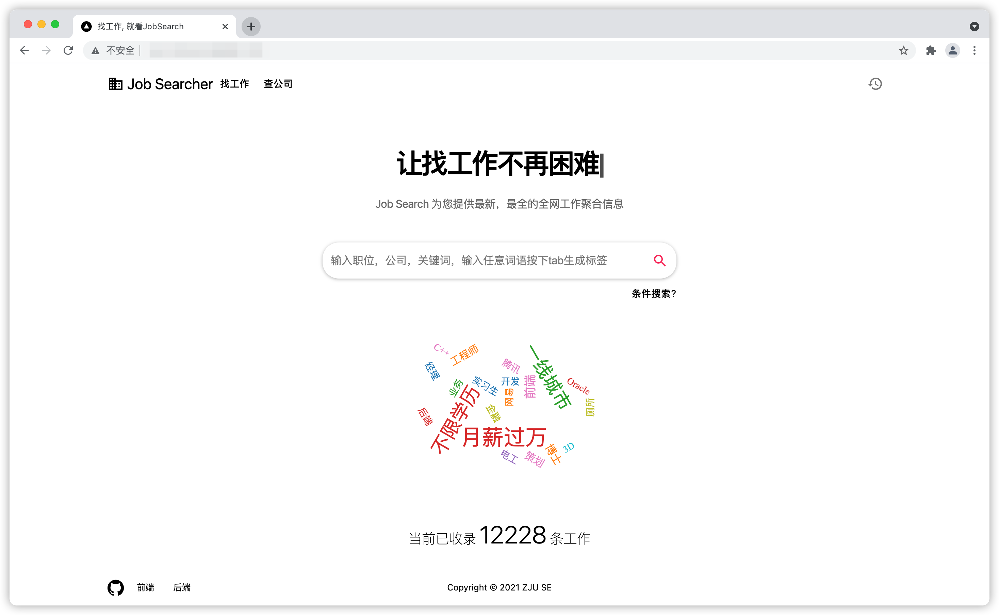
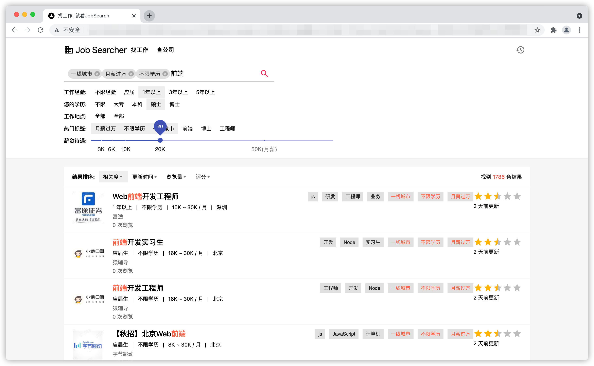
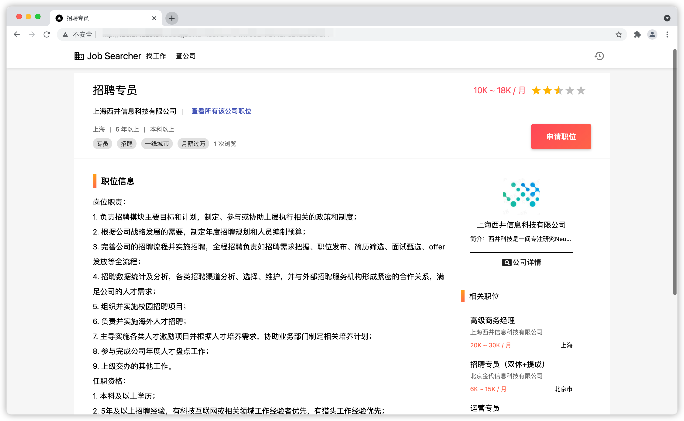
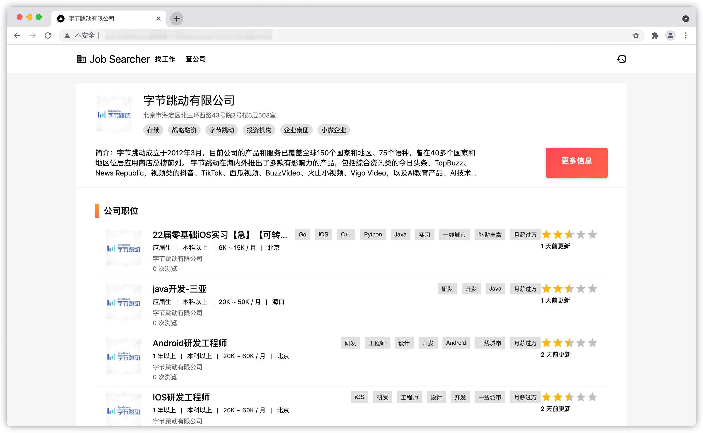
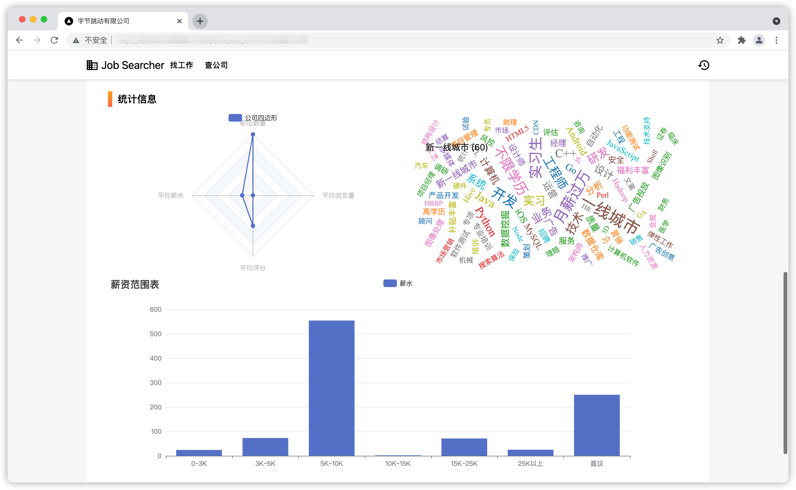
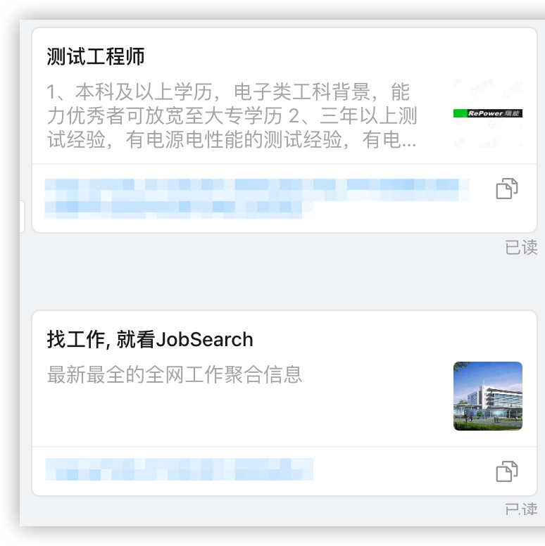
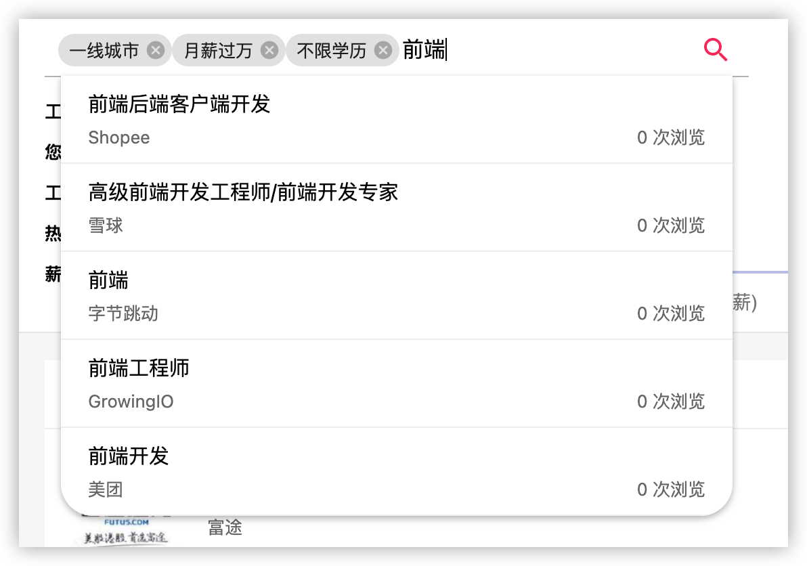

# JobSearch 工作搜索引擎

本项目是 ZJU 软件工程小学期项目，需求为做一个信息聚合的web项目。本项目做的是网络上工作招聘网站的信息聚合。用户可以进行条件搜索，标签搜索进行工作职位的搜索，也可以点击该工作对应的公司查看详细信息（公司的信息为天眼查上爬取）

项目有以下优缺点

- 一星期内制作，第一次使用 next.js，可能有些地方使用不太正确
- 手写大部分的CSS，美化项目 / 没有使用scss，冗余较多，略显混乱
- SSR项目，优化速度，做了SEO(开放图谱)
- all in typescript
- 因为迷之bug(apple silicon)，无法使用 next/image 优化图片
- 没有做宽度自适应(不想动了)
- 部分代码没有抽出组件，导致有些冗余
- 还可能有未知的bug

## 代码仓库

- [前端](https://github.com/konicyQWQ/jobse-fe)
- [后端](https://github.com/DWTwilight/JobSEServer)

## 技术栈

- 前端: `Next.js` + `React` + `Material-ui` + `手写css`
- 后端: `.net` + `elasticsearch`
- 爬虫: `scrapy` + `selenium` + `node` + `python`
- 数据库: `Mysql`

## 如何使用

```bash
git clone https://github.com/konicyQWQ/jobse-fe
cd jobse-fe
yarn
yarn dev
```

接下来访问 [localhost:3000](localhost:3000) 即可看到效果

## 文件结构

- `components/*`: 各种组件
- `server/index.ts`: axios的各种请求
- `styles/*`: 各种组件的css
- `pages/*`: 所有的页面

## 效果图










